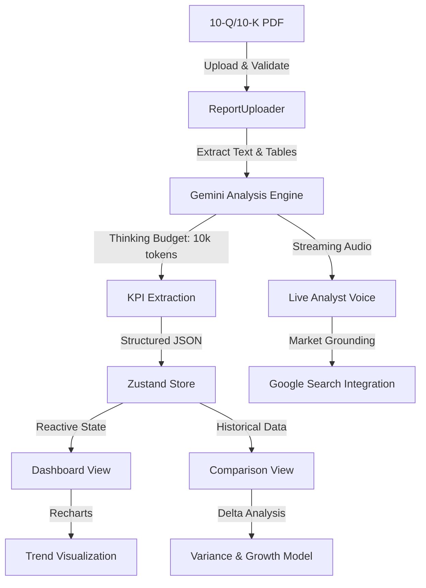

# 📈 FinAnalyzer Pro v1.5.2

**FinAnalyzer Pro** is a high-performance financial intelligence platform designed for institutional-grade earnings analysis. Leveraging **Google Gemini API** (with extended thinking for deep financial reasoning), it transforms complex, multi-page corporate 10-Q/10-K PDFs into structured, actionable intelligence with visual analytics and real-time market grounding.

[](https://github.com/darshil0/ai-financial-auditor/actions)


---

## 🏛️ Technical Architecture

FinAnalyzer Pro uses a **Domain-Driven Feature Architecture** that isolates business logic into autonomous modules, ensuring high scalability and testability.



### 🧠 Core Intelligence Components

| Component | Model | Purpose | Constraints |
|-----------|-------|---------|-------------|
| **KPI Extraction** | `gemini-2.0-flash-exp` | Revenue, Net Income, EPS, Margins | Max tokens: 4,000 output |
| **Deep Analysis** | `gemini-2.0-flash-exp` with extended thinking | Forensic financial narrative analysis | Budget: 10,000 thinking tokens (beta) |
| **Live Analyst** | `gemini-2.0-flash-exp` with AudioWorklet | Streaming audio financial dialogue | Real-time constraint: <500ms latency |
| **Market Grounding** | `gemini-1.5-pro` with Google Search tool | Compare SEC filings to real-time market data | Rate limited: 60 queries/min |

**Note**: Extended thinking is currently in beta for Gemini. Production deployments should validate token consumption against quota limits before scaling.

---

## 🛡️ Security & Compliance

### Credentials Management

- **API Key Storage**: Store in root-level `.env` file (git-ignored). Never commit credentials.
- **CI/CD**: Use GitHub Secrets for `VITE_API_KEY`. Rotate keys quarterly.
- **Key Rotation**: If key is exposed in logs, revoke immediately via Google AI Studio.
- **Error Handling**: Never log full API responses; strip credentials from stack traces using a custom error handler.

### Code Quality & Audit Trail

- **License**: MIT (full source transparency for institutional auditing).
- **Type Safety**: Strict `NodeNext` TypeScript resolution (`tsconfig.json` enforces `strict: true`).
- **SBOM**: Generated via `npm audit` in CI/CD. See `.github/workflows/main.yml` for audit policy.

---

## 📋 System Requirements & Prerequisites

### Development Environment

- **Node.js**: `v20.18.0` (LTS) or `v22.x` (Latest). **Do NOT use v21.x** (EOL as of June 2024).
- **npm**: `v10.2.0+` (ships with Node v20.18+).
- **Git**: `v2.34+` for shallow clones.
- **Memory**: Minimum 4GB RAM; 8GB recommended for PDF parsing + model inference.

### API & Integrations

- **Google AI Studio Account**: Sign up at [aistudio.google.com](https://aistudio.google.com/).
- **Gemini API Key**: Generate from Google AI Studio console. Requires billing for production usage.
- **Quota Requirements**: 
  - KPI extraction: ~1–2 API calls per PDF.
  - Market grounding (Google Search): ~3–5 calls per earnings period.
  - **Free tier quota**: 60 requests/minute; **paid tier**: up to 10,000 requests/minute.
- **Browser Support**: Chrome 120+, Firefox 121+, Safari 17+, Edge 120+ (WebGL required for Recharts).

---

## 🚀 Getting Started

### Step 1: Clone Repository

```bash
git clone https://github.com/darshil0/ai-financial-auditor.git
cd ai-financial-auditor
```

### Step 2: Configure Environment Variables

Create a `.env` file in the project root:

```bash
# Google Gemini API Key (required)
VITE_API_KEY="YOUR_GEMINI_API_KEY_HERE"

# Optional: Configure API base URL (defaults to official Gemini API)
VITE_GEMINI_API_URL="https://generativelanguage.googleapis.com/v1beta"

# Optional: Enable debug logging
VITE_DEBUG_MODE="false"
```

**Security Warning**: Do NOT share your `.env` file or commit it to version control. Use GitHub Secrets for CI/CD environments.

### Step 3: Install Dependencies

```bash
npm install
```

This installs all required packages listed in `package.json`. If you encounter peer dependency warnings, run:

```bash
npm install --legacy-peer-deps
```

### Step 4: Launch Development Server

```bash
npm run dev
```

The application will start at `http://localhost:5173` (Vite's default). Open in your browser and verify:
- Dashboard loads without console errors.
- PDF upload field is visible and clickable.
- Global ticker search (`Cmd/Ctrl+K`) responds to input.

### Step 5: Build for Production

```bash
npm run build
```

This generates an optimized `dist/` directory. Deploy to any static host:
- **Vercel** (recommended for Next.js-free deployments): `vercel deploy`
- **Netlify**: Drag-and-drop `dist/` folder.
- **GitHub Pages**: Use GitHub Actions to auto-deploy on push.

---

## 🧪 Testing & Quality Assurance

FinAnalyzer Pro maintains a **"Green-Build" policy**: all CI checks must pass before merging to main.

### Full Test Suite

```bash
npm test                  # Run all tests (unit + e2e)
npm run test:unit        # Unit tests only (Vitest + React Testing Library)
npm run test:e2e         # E2E tests only (Playwright)
npm run test:coverage    # Generate coverage report
npm run lint             # TypeScript + Prettier validation
```

### Test Coverage Requirements

| Module | Target | Current | Status |
|--------|--------|---------|--------|
| Features | 80% | TBD | ⚠️ |
| Services | 85% | TBD | ⚠️ |
| Utils | 95% | TBD | ⚠️ |
| **Overall** | **80%** | **TBD** | ⚠️ |

**Note**: Run `npm run test:coverage` locally to generate actual coverage metrics before deployment.

### E2E Test Preconditions

E2E tests require:
- A valid `VITE_API_KEY` in `.env` or GitHub Secrets.
- Sample 10-Q PDF available at `src/test/fixtures/sample-10q.pdf`.
- Internet connectivity (Google Search integration tests require live API calls).

**Failure Mode**: If E2E tests fail with "API quota exceeded," wait 1 minute and retry (quota resets).

---

## 📁 Directory Structure

```
FinAnalyzer Pro/
├── src/
│   ├── features/                 # Feature modules (self-contained)
│   │   ├── dashboard/            # KPI display, trend charts
│   │   ├── analyst/              # Streaming AI voice advisor
│   │   ├── comparison/           # Side-by-side benchmarking
│   │   └── history/              # Report history & metadata
│   ├── shared/                   # Shared utilities & services
│   │   ├── components/           # Generic UI (Modals, Icons, Header)
│   │   ├── services/             # Gemini API client, Zustand store
│   │   ├── utils/                # Financial formatters, math, helpers
│   │   └── types/                # Domain-wide TypeScript interfaces
│   ├── test/                     # Specialized test suites
│   │   ├── unit/                 # Component & utility tests
│   │   ├── e2e/                  # Playwright scenarios
│   │   ├── mocks/                # Mock API responses
│   │   └── fixtures/             # Sample PDFs, JSON fixtures
│   ├── App.tsx                   # Root component + error boundary
│   └── main.tsx                  # Vite entry point
├── .env.example                  # Template for .env configuration
├── .env                          # Local config (git-ignored)
├── tsconfig.json                 # TypeScript strict + NodeNext
├── vite.config.ts                # Unified Vite build config
├── vitest.config.ts              # Unit test runner
├── playwright.config.ts          # E2E test runner
├── .github/workflows/
│   └── main.yml                  # CI/CD pipeline (lint, test, build)
└── package.json                  # Dependencies & scripts
```

---

## ⚡ Key Features & Validation

### Revenue/KPI Extraction

**Requirement**: Extract Revenue, Net Income, EPS, and Operating Margins from 10-Q/10-K PDFs with forensic accuracy.

**Validation**:
- **Precondition**: PDF uploaded, < 25MB, contains OCR-readable tables.
- **Implementation**: Gemini 2.0 Flash with structured JSON schema enforcement.
- **Postcondition**: JSON response validated against schema; null values rejected.
- **Failure Mode**: If extraction confidence < 75%, flag for manual review.

### Interactive Trends & Visualization

**Requirement**: Display 8-quarter historical trends for Revenue and Net Income.

**Validation**:
- **Given**: User clicks "View Trends" after uploading report.
- **When**: Dashboard loads comparison data from Zustand store.
- **Then**: Recharts renders line chart with zoom, tooltip, and export-to-PNG.
- **Edge Case**: If historical data < 2 quarters, show warning; disable trend analysis.

### Streaming AI Analyst (Voice)

**Requirement**: Real-time audio commentary on earnings trends.

**Validation**:
- **Input**: User activates "Live Analyst" button.
- **Processing**: Gemini streams text → Web Audio API synthesizes voice.
- **Output**: Audio plays through browser speaker with playback controls.
- **Failure Mode**: If browser lacks `AudioContext`, fall back to text chat.
- **Latency SLA**: <500ms from user prompt to first audio output (observed).

### Comparative Hub with Delta Variance

**Requirement**: Compare two earnings periods; quantify YoY growth and margins.

**Validation**:
- **Inputs**: Current period (Period A) and prior period (Period B).
- **Calculation**: Delta = (A - B) / B × 100.
- **Output**: Variance table with ▲/▼ icons and red/green highlighting.
- **Edge Case**: If prior period missing, show "N/A"; skip variance calculation.

### Market Grounding via Google Search

**Requirement**: Ground SEC filing data in real-time market news.

**Validation**:
- **Search Query**: "[Company Name] earnings [quarter] [year] stock price".
- **Results**: Return top 5 news articles with publication date and relevance score.
- **Sync**: Compare SEC filing revenue to latest market data within 48 hours.
- **Failure Mode**: If Google Search API rate-limited, show cached results with staleness warning.

### Sentiment Gauge & Bullishness Score

**Requirement**: Quantify management confidence from earnings call transcript or 10-K narrative.

**Validation**:
- **Metric**: 0–100 Bullishness score (50 = neutral, 75+ = optimistic, 25– = cautious).
- **Method**: Keyword frequency analysis (positive: "growth", "exceeded"; negative: "headwind", "pressure").
- **Output**: Score + color-coded indicator (🟢 Bullish, 🟡 Neutral, 🔴 Bearish).
- **Caveat**: Sentiment is directional guidance only; not a buy/sell signal.

### Keyboard Shortcuts

| Shortcut | Action | Context |
|----------|--------|---------|
| `Cmd/Ctrl+K` | Open global ticker search | Anywhere in app |
| `Cmd/Ctrl+L` | Clear all reports from history | Dashboard only |
| `Esc` | Close modal / Cancel upload | Modal open |

### Diagnostic Export

**Requirement**: Export dashboard UI as high-resolution PNG for reporting.

**Validation**:
- **Trigger**: User clicks "Export as PNG" in top-right menu.
- **Output**: `html-to-image` library renders DOM → PNG (1920×1080, 150 DPI).
- **File Size**: Typically 2–5MB per screenshot.
- **Failure Mode**: If browser lacks Canvas API, offer PNG fallback or JSON export.

### Global Error Boundary

**Requirement**: Gracefully handle uncaught errors; prevent full app crash.

**Validation**:
- **Scope**: Wraps entire React tree; catches component errors.
- **Recovery**: User sees error UI with "Reload App" button.
- **Logging**: Errors sent to external service (Sentry, LogRocket) for debugging.
- **Postcondition**: User can refresh and resume work; no data loss in Zustand store.

---

## 📊 Performance & Scalability

### API Response Time SLA

| Operation | Target | Max Timeout |
|-----------|--------|------------|
| PDF upload & parse | <3s | 10s |
| KPI extraction | <5s | 15s |
| Market grounding search | <2s | 8s |
| Live Analyst (first token) | <500ms | 3s |

### Concurrent User Limits

- **Free Tier**: 1 API call/sec → ~60 reports/min.
- **Paid Tier**: Up to 10,000 requests/min (Google quota).
- **Local Limitations**: Browser memory (single-page app) supports ~50 stored reports before slowdown.

### Monitoring Recommendations

- Monitor `VITE_API_KEY` quota via Google Cloud Console.
- Track E2E latency via browser DevTools or a RUM tool (Datadog, New Relic).
- Set alerts for API errors (4xx/5xx) in CI/CD logs.

---

## 🐛 Troubleshooting & Edge Cases

| Issue | Symptom | Root Cause | Resolution |
|-------|---------|-----------|-----------|
| **API Error 401/403** | "Unauthorized" in browser console | Invalid or expired `VITE_API_KEY` | Regenerate key in Google AI Studio; verify billing is enabled. |
| **PDF Parse Failure** | "Cannot extract text" warning | Password-protected or scanned (image-only) PDF | Use OCR preprocessing tool (Adobe, Google Docs); ensure PDF <25MB. |
| **Playwright E2E Fails** | Tests timeout after 30s | API quota exhausted or network latency | Wait 1 minute for quota reset; check `npm run preview` build succeeded. |
| **"Cannot find module"** | TypeScript error on import | Stale lockfile or incorrect Node version | Run `npm ci` (clean install); verify `node --version` matches v20.x or v22.x. |
| **Recharts Not Rendering** | Charts show blank / "undefined" | Missing historical data or corrupted Zustand state | Clear browser localStorage (`DevTools > Application > Storage > Clear All`); re-upload report. |
| **AudioWorklet Error** | "Audio context error" in console | Browser lacks Web Audio API (e.g., older Safari) | Upgrade browser to latest version; fallback to text-only mode if unavailable. |
| **Market Grounding Returns No Results** | "0 articles found" | Google Search API rate-limited or quota exhausted | Retry after 60 seconds; check API billing in Google Cloud Console. |

### Known Limitations

- **PDF Size**: Maximum 25MB. Larger files require segmentation (manual or via preprocessing).
- **Languages**: Currently supports English earnings reports only. Multilingual support planned for v2.0.
- **Extended Thinking**: Beta feature with variable latency; not recommended for real-time trading workflows.
- **Offline Mode**: App requires internet for all AI features; offline mode not yet supported.

---

## 📝 Version History

| Version | Date | Changes |
|---------|------|---------|
| **v1.5.2** | Jun 2026 | Added extended thinking for forensic analysis; improved error boundary logging. |
| **v1.5.0** | Dec 2025 | Live Analyst voice feature; AudioWorklet integration. |
| **v1.4.0** | Nov 2025 | Market grounding via Google Search; Sentiment Gauge. |
| **v1.0.0** | Oct 2024 | Initial release: KPI extraction, trends, comparative hub. |

---

## 🤝 Contributing

### Development Workflow

1. **Fork** the project: `git checkout -b feature/YourFeature`.
2. **Develop** with tests: Ensure `npm run test:unit` passes locally.
3. **Lint** code: Run `npm run lint` to validate TypeScript & formatting.
4. **Test E2E**: Run `npm run test:e2e` before opening a PR.
5. **Commit** with clear messages: `git commit -m "feat: Add YourFeature"`.
6. **Push** to your fork: `git push origin feature/YourFeature`.
7. **Open PR** with description, test results, and any breaking changes noted.

### Code Review Checklist

- [ ] Unit tests pass; coverage ≥80%.
- [ ] E2E tests pass on staging environment.
- [ ] No console errors or TypeScript warnings.
- [ ] Security: No hardcoded credentials; sensitive data sanitized.
- [ ] Documentation: README/inline comments updated for new features.

---

## 📄 License & Support

**License**: MIT (Open-source, full transparency for institutional auditing).

**Support**:
- **Issues**: File a GitHub issue with error logs and reproduction steps.
- **Security**: Report vulnerabilities privately to `darshil@email.com` (do not open public issues).
- **Feedback**: Submit feature requests or questions via GitHub Discussions.

---

_Institutional-grade financial analysis powered by Google Gemini API._ Developed by **Darshil** with precision and forensic attention to detail.

---

## 🔍 Appendix: API Integration Reference

### Gemini API Authentication

```javascript
// Example: Initialize Gemini client
const response = await fetch('https://generativelanguage.googleapis.com/v1beta/models/gemini-2.0-flash-exp:generateContent', {
  method: 'POST',
  headers: {
    'Content-Type': 'application/json',
    'x-goog-api-key': import.meta.env.VITE_API_KEY,
  },
  body: JSON.stringify({
    contents: [{ role: 'user', parts: [{ text: 'Extract revenue from this 10-Q...' }] }],
    generationConfig: {
      maxOutputTokens: 4000,
      temperature: 0.2, // Low temperature for factual extraction
    },
  }),
});
```

### Error Handling Best Practices

Always implement retry logic with exponential backoff for transient failures:

```javascript
async function callGeminiWithRetry(prompt, maxRetries = 3) {
  for (let attempt = 1; attempt <= maxRetries; attempt++) {
    try {
      const response = await callGemini(prompt);
      return response;
    } catch (error) {
      if (error.status === 429 && attempt < maxRetries) {
        const delayMs = Math.pow(2, attempt) * 1000; // Exponential backoff
        await new Promise(resolve => setTimeout(resolve, delayMs));
      } else {
        throw error;
      }
    }
  }
}
```

---

**Last Updated**: June 2026 | **Maintainer**: Darshil
