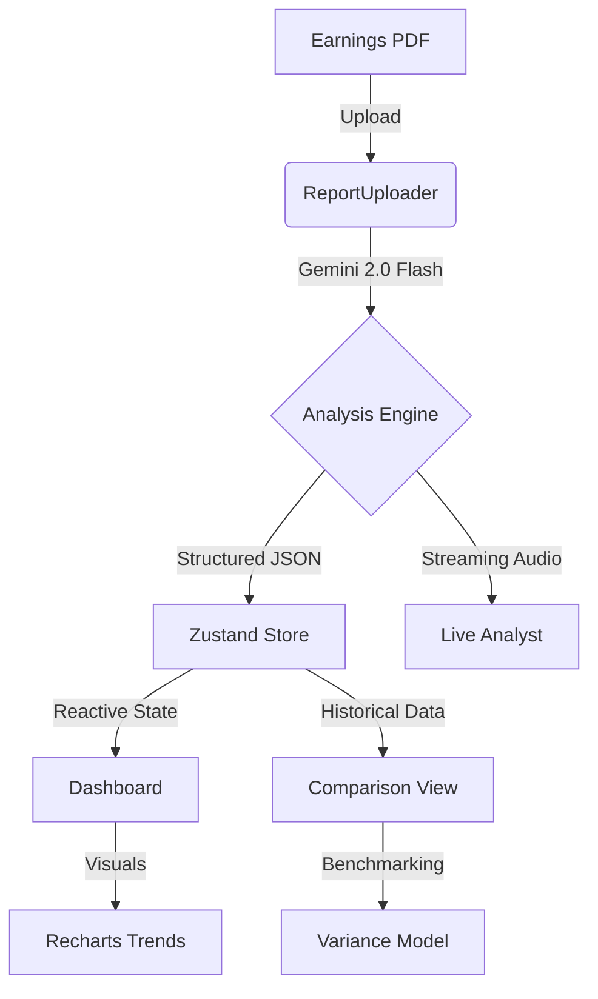

# 📈 FinAnalyzer Pro v1.5.0

**FinAnalyzer Pro** is a high-performance financial intelligence platform designed for institutional-grade earnings analysis. Leveraging **Gemini 2.0 Flash**, it transforms complex, multi-page corporate 10-Q/10-K PDFs into structured, actionable intelligence with visual analytics and real-time market grounding.

[](https://github.com/darshil0/ai-financial-auditor/actions)


---

## 🏛️ Technical Architecture

FinAnalyzer Pro uses a **Domain-Driven Feature Architecture** that isolates business logic into autonomous modules, ensuring high scalability and testability.



### 🧠 Core Intelligence
- **Primary Engine**: Gemini 2.0 Flash (Multimodal & TTS).
- **Thinking Budget**: 16,000 tokens for surgical YoY reconciliation.
- **Data Flow**: Reactive state management via Zustand with persistent local storage.

---

## 🚀 Key Features

- **⚡ Sub-Second Extraction**: Specialized prompts for Revenue, Net Income, EPS, and Margins with forensic accuracy.
- **📊 Interactive Trends**: Responsive Recharts visualizing revenue and net income velocity across historical quarters.
- **🎙️ Streaming AI Analyst**: Real-time voice-first advisor for low-latency financial dialogue.
- **⚖️ Comparative Hub**: Side-by-side benchmarking with automatic delta variance and growth modeling.
- **🔍 Market Grounding**: Integrated Google Search tools to contrast report data with real-time market developments.
- **Sentiment Gauge**: Quantifies management's verbal confidence into a 0-100 Bullishness score.

---

## 🛠️ Getting Started

### 📋 Prerequisites
- **Node.js**: `v20.x` or `v22.x` (Recommended).
- **Package Manager**: `npm` (v10+).
- **API Key**: A valid [Google AI Studio](https://aistudio.google.com/) API Key.

### ⚙️ Installation

1. **Clone the Repository**:
   ```bash
   git clone https://github.com/darshil0/ai-financial-auditor.git
   cd ai-financial-auditor
   ```

2. **Configure Environment**:
   Create a `.env` file in the root:
   ```bash
   VITE_API_KEY="YOUR_GEMINI_API_KEY"
   ```

3. **Install Dependencies**:
   ```bash
   npm install
   ```

4. **Launch Development Server**:
   ```bash
   npm run dev
   ```
   Access the UI at `http://localhost:3000`.

---

## 🧪 Testing & Quality Assurance

FinAnalyzer Pro maintains a rigorous "Green-Build" policy via GitHub Actions.

- **Full Suite**: `npm test` (Unit + E2E).
- **Unit Tests**: `npm run test:unit` (Vitest & React Testing Library).
- **E2E Tests**: `npm run test:e2e` (Playwright on production preview).
- **Linting**: `npm run lint` (TypeScript NodeNext validation + Prettier).

---

## 📁 Directory Structure

The project follows a **Feature-Based Module** pattern:

- `@/features/`: Fully encapsulated modules (Dashboard, Analyst, Comparison, History).
- `@/shared/`: Cross-cutting concerns:
    - `components/`: Generic UI (Modals, Icons, Header).
    - `services/`: API (Gemini) and Store (Zustand) logic.
    - `utils/`: Financial formatters and math utilities.
    - `types/`: Domain-wide TypeScript interfaces.
- `@/test/`: Specialized test suites (Unit, E2E, Mocks).

---

## ⚠️ Troubleshooting

| Issue | Resolution |
| :--- | :--- |
| **API Error (401/403)** | Ensure `VITE_API_KEY` is present in `.env` and has "Gemini API" enabled in Google AI Studio. |
| **Playwright Fails in CI** | The project uses `npm run preview` in CI. Ensure your build has completed successfully. |
| **"Cannot find module"** | Run `npm install`. The project uses `NodeNext` resolution; ensures your IDE supports TS 5.x. |
| **PDF Parsing Issues** | Ensure the PDF is not password-protected and contains text/tables (not just images). |

---

## 🤝 Contributing

1. **Fork** the project and create your feature branch: `git checkout -b feature/AmazingFeature`.
2. **Commit** your changes: `git commit -m "feat: Add AmazingFeature"`.
3. **Internal Tools**: Ensure `npm run lint` passes before pushing.
4. **Push** to the branch: `git push origin feature/AmazingFeature`.
5. Open a **Pull Request**.

---

_Institutional-grade financial analysis powered by Google GenAI._ Developed by **Darshil** with Precision.
