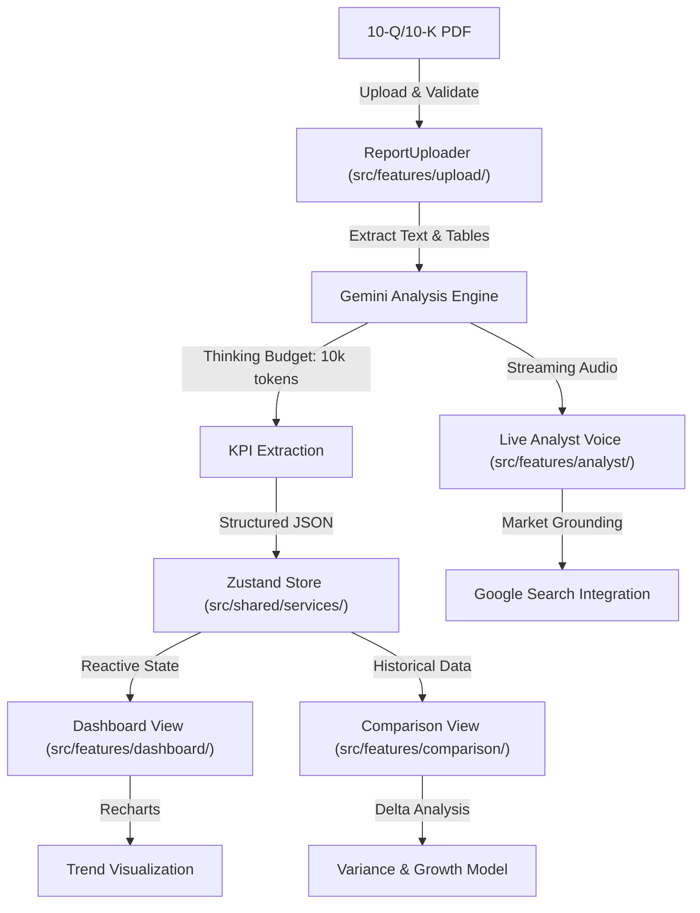

# 📈 FinAnalyzer Pro v1.5.5

**FinAnalyzer Pro** is a high-performance financial intelligence platform designed for institutional-grade earnings analysis. Leveraging the **Google Gemini API** with extended thinking for deep forensic analysis, it transforms raw corporate earnings PDFs into actionable financial insights with dashboard visualization, sentiment analysis, and comparative intelligence for financial professionals.

[](https://github.com/darshil0/ai-financial-auditor/actions)


---

## 🏛️ Technical Architecture

FinAnalyzer Pro uses a **Domain-Driven Feature Architecture** that isolates business logic into autonomous feature modules and shared, cross-cutting services, ensuring high scalability and testability.


```mermaid
graph TD
    A["10-Q/10-K PDF"] -->|Upload & Validate| B["ReportUploader (src/features/upload/)"]
    B -->|Extract Text & Tables| C["Gemini Analysis Engine"]
    C -->|Thinking Budget: 10k tokens| D["KPI Extraction"]
    D -->|Structured JSON| E["Zustand Store (src/shared/services/)"]
    E -->|Reactive State| F["Dashboard View (src/features/dashboard/)"]
    E -->|Historical Data| G["Comparison View (src/features/comparison/)"]
    C -->|Streaming Audio| H["Live Analyst Voice (src/features/analyst/)"]
    F -->|Recharts| I["Trend Visualization"]
    G -->|Delta Analysis| J["Variance & Growth Model"]
    H -->|Market Grounding| K["Google Search Integration"]
```

### 🧠 Core Intelligence Components & Model Tiers

The application employs a tiered AI model approach inside `src/shared/services/geminiService.ts`:

| Component            | Model              | Purpose                                  | Constraints / Configuration                                                   |
| -------------------- | ------------------ | ---------------------------------------- | ----------------------------------------------------------------------------- |
| **KPI Extraction**   | `gemini-2.0-flash` | Revenue, Net Income, EPS, Margins        | Max tokens: 4,000 output. Uses low temperature (0.1) for surgical precision. |
| **Deep Analysis**    | `gemini-2.0-flash` | Forensic financial narrative analysis    | Budget: 10,000 thinking tokens.                                               |
| **Live Analyst**     | `gemini-2.0-flash` | Real-time streaming voice advisory       | Utilizes `ScriptProcessorNode` to stream low-latency PCM audio blocks.       |
| **Market Grounding** | `gemini-1.5-pro`   | Compare SEC filings to real-time context | Google Search tool. Rate limited: 60 queries/min. Omit `thinkingConfig`.      |

---

## 🛡️ Security & Compliance

### Credentials Management

- **API Key Storage**: Store in root-level `.env` file (git-ignored). Never commit credentials.
- **CI/CD**: Use GitHub Secrets for `VITE_API_KEY`.
- **Key Rotation**: If a key is exposed in logs, revoke immediately via Google AI Studio.
- **Error Handling**: Never log full API responses; sanitize stack traces before rendering or logging.

### Code Quality & Audit Trail

- **License**: MIT (full source transparency for institutional auditing).
- **Type Safety**: Strict TypeScript compilation with path aliases (`@/` mapping to `src/`).
- **Module Resolution**: Configured with `moduleResolution: "Bundler"` (with `baseUrl` removed from `tsconfig.json` to guarantee proper path resolution).
- **CI/CD Auditing**: Continuous auditing via `.github/workflows/main.yml`, featuring blocking critical `npm audit`, pinned GitHub Actions with hash verification, and weekly Dependabot updates.

---

## 📋 System Requirements & Prerequisites

### Development Environment

- **Node.js**: `v24.x` (LTS, recommended) or `v22.x`.
- **npm**: `v10.x` or `v11.x+` (ships with Node v24.x).
- **Git**: `v2.34+` for shallow clones.
- **Memory**: Minimum 4 GB RAM; 8 GB recommended.
- **Packages**: Vite 8.1.3, TypeScript 6.0.3, Recharts 3.9.1, Vitest 4.1.9.

### API & Integrations

- **Google AI Studio Account**: Sign up at [aistudio.google.com](https://aistudio.google.com/).
- **Gemini API Key**: Required for earnings analysis and the real-time AI analyst.
- **Browser Support**: Chrome 120+, Firefox 121+, Safari 17+, Edge 120+ (WebGL for Recharts; Web Audio API for Live Analyst).

---

## 🚀 Getting Started

### Step 1: Clone Repository

```bash
git clone https://github.com/darshil0/ai-financial-auditor.git
cd ai-financial-auditor
```

### Step 2: Configure Environment Variables

Create a `.env` file in the project root:

```bash
# Google Gemini API Key (required)
VITE_API_KEY="YOUR_GEMINI_API_KEY"
```

**Security Warning**: Do not share your `.env` file or commit it to version control.

### Step 3: Install Dependencies and Setup Browsers

```bash
npm install
npx playwright install
```

This installs all required packages and downloads Playwright browser binaries for end-to-end testing.

### Step 4: Launch Development Server

```bash
npm run dev
```

The application will start at `http://localhost:3000`. Open it in your browser and verify:

- Dashboard loads without console errors.
- Dark mode toggle applies synchronously via an inline script in `index.html` to prevent initial load flashing.

### Step 5: Build for Production

```bash
npm run build
```

This generates an optimized `dist/` directory. Deploy to any static hosting provider.

---

## 🧪 Testing & Quality Assurance

FinAnalyzer Pro enforces a **Green-Build policy**: all CI checks must pass before merging to `main`.

### Full Test Suite

```bash
npm run test:all                 # Run all tests (unit + E2E); requires npm run build first
npm run test:unit                # Run unit and component tests
npm run test:e2e                 # Run Playwright E2E tests
npm run test:unit -- --coverage  # Generate code coverage reports
npm run format                   # Format codebase using Prettier
npm run lint                     # Typecheck and Prettier style validation
```

### Test Coverage Requirements

- **Strict Thresholds**: Line coverage is strictly configured at **80%** in `vite.config.ts`.
- **CI Summary**: Vitest generates a `json-summary` coverage report for automated CI validation.
- **Reporting**: Playwright E2E tests produce JUnit results at `test-results/junit.xml` for GitHub Actions reporting.

---

## 📁 Directory Structure

```text
FinAnalyzer Pro/
├── src/
│   ├── features/                 # Modular feature domains
│   │   ├── dashboard/            # KPI summaries, trend charts, executive briefing
│   │   ├── analyst/              # Live AI Analyst voice dialogue
│   │   ├── comparison/           # Benchmarking and variance analysis
│   │   ├── history/              # Report history vault
│   │   └── upload/               # PDF upload and client validation
│   ├── shared/                   # Shared services, models, and assets
│   │   ├── components/           # Reusable UI components
│   │   ├── services/             # Gemini API client, Zustand global store
│   │   ├── utils/                # Financial formatters, math, Tailwind helper
│   │   └── types/                # Domain-wide TypeScript interfaces
│   ├── test/                     # Testing suite
│   │   ├── unit/                 # Component and utility unit tests
│   │   ├── e2e/                  # Playwright end-to-end user journeys
│   │   └── setup.ts              # Vitest setup environment
│   ├── App.tsx                   # Main React tree
│   └── index.tsx                 # Application entry point
├── .env.example                  # Template for API credentials
├── .env                          # Local credentials (git-ignored)
├── tsconfig.json                 # TypeScript compiler configuration
├── vite.config.ts                # Vite and Vitest configuration
├── playwright.config.ts          # Playwright E2E configuration
├── .github/workflows/
│   └── main.yml                  # CI/CD workflow
└── package.json                  # Scripts and dependency configuration
```

---

## ⚡ Key Features & Implementation Highlights

### Revenue and KPI Extraction

- **Requirement**: Extract Revenue, Net Income, EPS, and Operating Margins from corporate PDFs with forensic accuracy.
- **Implementation**: Handled via `gemini-2.0-flash` with a strict JSON schema in `src/shared/services/geminiService.ts`.
- **Validation**: Rejects incomplete or malformed AI payloads, preventing calculations on partial data.

### Interactive Trends and Visualization

- **Requirement**: Display quarterly historical trends for Revenue and Net Income.
- **Implementation**: Powered by `recharts` for responsive line charts.
- **Feature**: Supports zoom, tooltips, and responsive layouts.

### Streaming AI Analyst Voice

- **Requirement**: Interactive real-time audio dialogue on earnings trends.
- **Implementation**: Powered by the `gemini-2.0-flash` real-time API. Captures microphone inputs using a low-latency Web Audio `ScriptProcessorNode` to stream PCM audio.
- **Robust Session Stability**: Uses a stable report ID reference in dependency arrays within `src/features/analyst/LiveAnalyst.tsx` to prevent connection restarts.

### Comparative Hub with Delta Variance

- **Requirement**: Benchmark reports side by side with automatic growth computation.
- **Guardrails**: Restricted in `src/shared/components/Sidebar.tsx` unless at least two reports are uploaded.
- **Performance**: In `src/features/comparison/ComparisonView.tsx`, the `MetricRow` component is defined outside the main function to eliminate redundant remounts.

### Market Grounding via Google Search

- **Requirement**: Cross-examine SEC filing reports with real-time web context.
- **Implementation**: Powered by `gemini-1.5-pro` with the Google Search tool enabled.
- **Constraint**: Omit `thinkingConfig` because it is only compatible with Gemini 2.0+ models.

### User Accessibility and Control

- **Shortcuts**: Implements `Cmd/Ctrl+K` to focus the header search input on desktop devices.
- **Client-Side Size Limits**: Enforces a strict 25 MB PDF upload limit in `src/features/upload/ReportUploader.tsx`.
- **Memory Safety**: `Dashboard.tsx` revokes Blob URLs created for audio briefings using `URL.revokeObjectURL` during unmount.
- **Utilities Protection**: Financial formatters and calculators in `src/shared/utils/index.ts` guard against `NaN` and `Infinity`.
- **Diagnostics**: Supports exporting analyzed reports as standard JSON from the Dashboard.

### Resilience and Crash Prevention

- **Global Error Boundary**: Implemented in `src/shared/components/ErrorBoundary.tsx`, wrapping the main content area in `src/App.tsx`.
- **Custom Modals**: Uses a custom `Modal` component and `showErrorModal` in `src/App.tsx` for application-wide error handling.
- **TypeScript Generic Support**: Class-based React components, such as `ErrorBoundary`, explicitly declare generic Props and State type parameters.

---

## 📝 Version History

Refer to [CHANGELOG.md](CHANGELOG.md) for complete release notes.

---

## 🤝 Contributing

We welcome professional contributions. Before opening a pull request:

1. Ensure unit tests pass and coverage remains at or above **80%**.
2. Format changes using `npm run format`.
3. Follow the repository’s standard Git commit structure.

---
Institutional-grade financial analysis powered by Google Gemini API. Developed with precision and forensic attention to detail.
